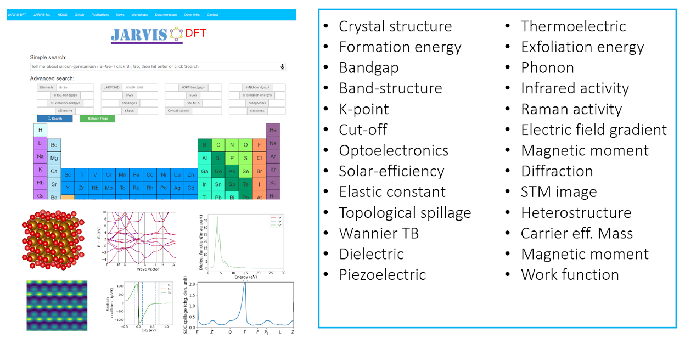

JARVIS-DFT is a density functional theory-based database for ~40000 3D, ~1000 2D materials and around a million calculated properties. JARVIS-DFT mainly uses vdW-DF-OptB88 functional for geometry optimization. It also uses beyond-GGA approaches, including Tran-Blaha modified Becke-Johnson (TBmBJ) meta-GGA, PBE0, HSE06, DMFT, G0W0 for analyzing selective cases. In addition to hosting conventional properties such as formation energies, bandgaps, elastic constants, piezoelectric constants, dielectric constants, and magnetic moments, it also contains unique datasets, such as exfoliation energies for van der Waals bonded materials, spin-orbit coupling spillage, improved meta-GGA bandgaps, frequency-dependent dielectric function, spin-orbit spillage, spectroscopy limited maximum efficiency (SLME), infrared (IR) intensities, electric field gradient (EFG), heterojunction classifications, and Wannier tight-binding Hamiltonians. These datasets are compared to experimental results wherever possible, to evaluate their accuracy as predictive tools. JARVIS-DFT introduces protocols such as automatic k-point convergence that can be critical for obtaining precise and accurate calculation results.

