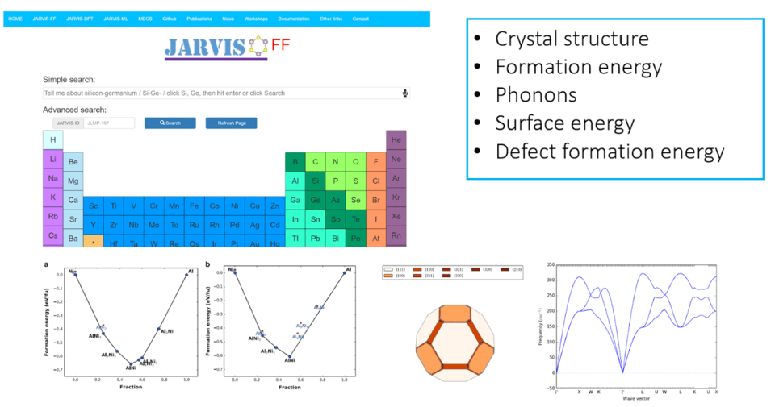

JARVIS-FF is a repository of classical force-field/potential calculation data intended to help users select the most appropriate force-field for a specific application. Many classical force-fields are developed for a particular set of properties (such as energies), and may not have been tested for properties not included in training (such as elastic constants, or defect formation energies). JARVIS-FF provides an automatic framework to consistently calculate and compare basic properties, such as the bulk modulus, defect formation energies, phonons, etc. that may be critical for specific molecular-dynamics simulations. JARVIS-FF relies on DFT and experimental data to evaluate accuracy.

